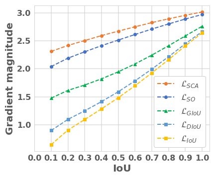
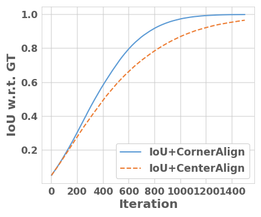
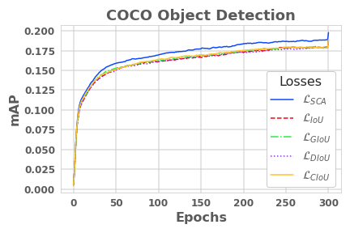

# SCALoss
PyTorch implementation of the paper "[SCALoss: Side and Corner Aligned Loss for Bounding Box Regression](https://arxiv.org/abs/2104.00462)" (AAAI 2022).


## Introduction


<p align="left">
  
  
</p>

- IoU-based loss has the gradient vanish problem in the case of low overlapping bounding boxes with slow convergence speed.
- Side Overlap can put more penalty for low overlapping bounding box cases and Corner Distance can speed up the convergence.
- SCALoss, which combines Side Overlap and Corner Distance, can serve as a comprehensive similarity measure, leading to better localization performance and faster convergence speed.


## Prerequisites
- [**Python>=3.6.0**](https://www.python.org/)
- [**PyTorch>=1.7**](https://pytorch.org/get-started/locally/)
- Other dependencies described in [requirements.txt](https://github.com/Turoad/SCA-YOLO/blob/master/requirements.txt)

## Install
Conda is not necessary for the installation.
Nevertheless, the installation process here is described using it.
```bash
$ conda create -n sca-yolo python=3.8 -y
$ conda activate sca-yolo
$ git clone https://github.com/Turoad/SCALoss
$ cd SCALoss
$ pip install -r requirements.txt
```

## Getting started
Train a model:
```
python train.py --data [dataset config] --cfg [model config] --weights [path of pretrain weights] --batch-size [batch size num]
```
For example, to train yolov3-tiny on COCO dataset from scratch with batch size=128.
```
python train.py --data coco.yaml --cfg yolov3-tiny.yaml --weights '' --batch-size 128
```
For multi-gpu training, it is recommended to use:
```
python -m torch.distributed.launch --nproc_per_node 4 train.py --img 640 --batch 32 --epochs 300 --data coco.yaml --weights '' --cfg yolov3.yaml --device 0,1,2,3
```

Test a model:
```
python val.py --data coco.yaml --weights runs/train/exp15/weights/last.pt --img 640 --iou-thres=0.65
```

## Results and Checkpoints
<!-- LIoU 
LGIoU 
relative improv.(%) 0% 0% -0.37% 1.73% 1.72% 10.53%
LDIoU 18.8 36.4 26.9 17.2 11.8 1.9
relative improv.(%) 0% 0.55% -1.1% -0.58% 1.72% 0%
LCIoU 18.9 36.6 27.3 17.2 11.6 2.1
relative improv.(%) 0.53% 1.1% 0.37% -0.58% 0% 10.53%
LSCA 19.9 36.6 28.3 19.1 13.3 2.7
relative improv.(%) 5.85% 1.1% 4.04% 10.4% 14.66% 42.11% -->
### YOLOv3-tiny
[assets]: https://github.com/turoad/SCALoss/releases

|Model |mAP<br>0.5:0.95 |AP<br>0.5 | AP<br>0.65 | AP<br>0.75| AP<br>0.8| AP<br>0.9
|---                    |---    |---    |---    |---    |---    |---    
[IoU][assets]|18.8|36.2|27.2|17.3|11.6|1.9
[GIoU][assets]<br>relative improv.(%) | 18.8<br>0% | 36.2<br>0% | 27.1<br>-0.37% | 17.6<br>1.73% | 11.8<br>1.72% | 2.1<br>10.53%
[DIoU][assets]<br>relative improv.(%) | 18.8<br>0% | 36.4<br>0.55% | 26.9<br>-1.1% | 17.2<br>-0.58% | 11.8<br>1.72% | 1.9<br>0%
[CIoU][assets]<br>relative improv.(%) | 18.9<br>0.53% | 36.6<br>1.1% | 27.3<br>0.37% | 17.2<br>-0.58% | 11.6<br>0% | 2.1<br>10.53%
[SCA][assets]<br>relative improv.(%) | 19.9<br>5.85% | 36.6<br>1.1% | 28.3<br>4.04% | 19.1<br>10.4% | 13.3<br>14.66% | 2.7<br>42.11%

The convergence curves of different losses on YOLOV3-tiny:


### YOLOv3

|Model |mAP<br>0.5:0.95 |AP<br>0.5 | AP<br>0.65 | AP<br>0.75| AP<br>0.8| AP<br>0.9
|---                    |---    |---    |---    |---    |---    |---    
[IoU][assets]|44.8|64.2|57.5|48.8|41.8|20.7
[GIoU][assets]<br>relative improv.(%) | 44.7<br>-0.22% | 64.4<br>0.31% | 57.5<br>0% | 48.5<br>-0.61% | 42<br>0.48% | 20.4<br>-1.45%
[DIoU][assets]<br>relative improv.(%) | 44.7<br>-0.22% | 64.3<br>0.16% | 57.5<br>0% | 48.9<br>0.2% | 42.1<br>0.72% | 19.8<br>-4.35%
[CIoU][assets]<br>relative improv.(%) | 44.7<br>-0.22% | 64.3<br>0.16% | 57.5<br>0% | 48.9<br>0.2% | 41.7<br>-0.24% | 19.8<br>-4.35%
[SCA][assets]<br>relative improv.(%) | 45.3<br>1.12% | 64.1<br>-0.16% | 57.9<br>0.7% | 49.9<br>2.25% | 43.3<br>3.59% | 21.4<br>3.38%

### YOLOV5s
comming soon

## Citation
If our paper and code are beneficial to your work, please consider citing:
```
@inproceedings{zheng2022scaloss,
  title={SCALoss: Side and Corner Aligned Loss for Bounding Box Regression},
  author={Zheng, Tu and Zhao, Shuai and Liu, Yang and Liu, Zili and Cai, Deng},
  booktitle={Proceedings of the AAAI Conference on Artificial Intelligence},
  year={2022}
}
```

## Acknowledgement
The code is modified from [ultralytics/yolov3](https://github.com/ultralytics/yolov3).
